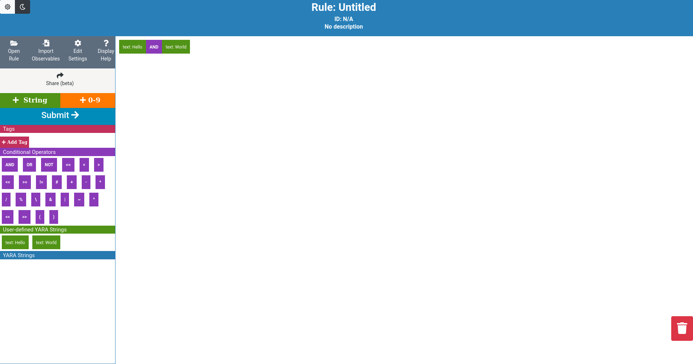
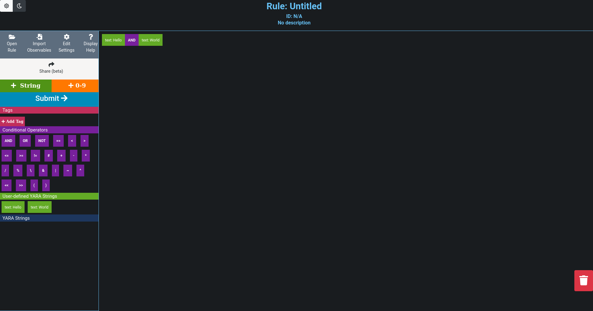

# YARA-Designer GUI (Web Frontend)

## Preview
Light theme                                                    | Dark theme
---------------------------------------------------------------|--------------------------------------------------------
 | 

## Dependencies
### Git repository
The following Git repository must be set up and available.
- TheOracle (YARA rules git repository)
### Projects
The following projects must be running and available over network.
- yara-designer-core (backend/API)

### Frameworks
- Node.js (node/npm)

## Setup
1. Copy `dotenv.sample` to `.env` and [configure](#dotenv-configuration) it.
2. Install packages: `$ npm install` (for dependencies see `packages.json`).

## Usage
1. Start the web server: `$ npm start`
2. Open the YARA-Designer web page.

## Appendix

### DotEnv Configuration
| Option                   | Description                 | Default |
|--------------------------|-----------------------------|---------|
|BIND_HOST                 | IP ExpressJS listens on     |0.0.0.0  |
|BIND_PORT                 | Port ExpressJS listens on   | 3001    |
|SUB_PATH                  | Path under webroot (ex: `yara-designer/`) | undefined
|BACKEND_HOST              | Backend URI          |http://localhost:5001 |
|POST_RULE_ROUTE           | Backend API endpoint for POST-ing YARA rule|/api/v1/core/rule
|POST_COMMIT_ROUTE         | Backend API endpoint for POST-ing a commit|/api/v1/core/commit
|GET_RULES_ROUTE           | Backend API endpoint for GET-ing all TheHive rules from DB|/api/v1/core/rules
|GET_RULE_ROUTE            | Backend API endpoint for GET-ing a TheHive rule from DB|/api/v1/core/rule
|GET_THEORACLE_RULES_ROUTE | Backend API endpoint for GET-ing all YARA rules from TheOracle Git|/api/v1/theoracle/rules
|GET_THEORACLE_RULE_ROUTE  | Backend API endpoint for GET-ing a YARA rule from TheOracle Git|/api/v1/theoracle/rule

### Optional URL parameters
| Parameter | Description                                               |
|-----------|-----------------------------------------------------------|
| id        | Loads case with the given case ID                         |
| filename  | Loads case by the given filename (TheOracle rules dir)    |
| theme     | Use custom theme (currently only supports `light`/`dark`) |

